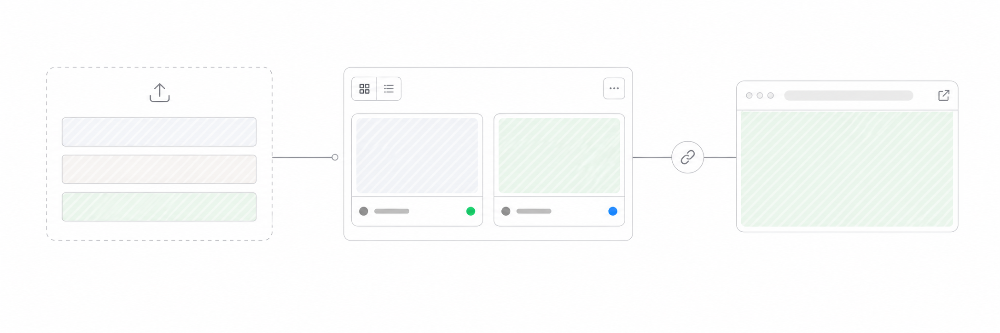
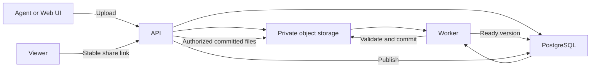

# ShareSlices

<div align="center">

<strong>Turn agent-made web artifacts into links worth sharing.</strong>

ShareSlices is the open-source share layer for interactive HTML reports,
presentations, and slice decks created by AI agents.

[Why ShareSlices?](#why-shareslices) · [Quick start](#quick-start) ·
[How it works](#how-it-works) · [Development](#development)

</div>



> [!IMPORTANT]
> ShareSlices is under active development. The current product targets desktop
> browsers and public, time-bounded sharing of static web artifacts.

## Why ShareSlices?

AI agents can create polished reports and presentations, but the result often
stops at a local folder. ShareSlices picks up where the agent finishes: it
packages the artifact, validates it, keeps immutable versions, and publishes a
stable link that other people can open in a browser.

| | What you get |
| --- | --- |
| **Agent-first** | A Skill-to-CLI path designed for Claude, Codex, and similar tools |
| **Web-native** | Publish interactive HTML, CSS, JavaScript, images, fonts, and data files |
| **Versioned** | Every upload becomes an immutable version that can be previewed or republished |
| **Stable links** | Update the published version without making your audience chase a new URL |
| **Time-bounded** | Publish permanently, for a relative duration, or until an exact time |
| **Self-hosted** | Run the web app, API, worker, PostgreSQL, and S3-compatible storage yourself |

## The sharing workflow

```text
Ask an agent to create an artifact
                  ↓
     Upload and validate the bundle
                  ↓
       Create an immutable version
                  ↓
        Preview, then publish it
                  ↓
        Share one stable browser link
```

Upload and Publish are intentionally separate. Upload creates version history
without exposing content. Publish selects a ready version, makes it externally
accessible for a chosen duration, and returns the share link.

## Quick start

### Prerequisites

- [mise](https://mise.jdx.dev/)
- [Docker](https://docs.docker.com/get-docker/) with Docker Compose
- [pnpm](https://pnpm.io/) through the version declared by this repository

### Run locally

```bash
git clone https://github.com/walnut1024/ShareSlices.git
cd ShareSlices

cp .env.example .env
mise install
mise run install
mise run dev
```

Open [http://127.0.0.1:5173](http://127.0.0.1:5173). The local stack also
starts PostgreSQL, MinIO, the background worker, and Mailpit. Values marked
`required` in `.env.example` are development placeholders and must be replaced
before any real deployment.

To stop the containers:

```bash
mise run dev-down
```

## What can be published?

ShareSlices accepts a ZIP bundle with a root HTML entry point. The Web UI also
accepts a single self-contained `.html` or `.htm` file and packages it for you.

Good fits include:

- interactive reports and data stories
- keynote-style HTML presentations
- product demos and prototypes
- generated documentation and explainers
- other static, browser-rendered agent output

Artifacts can include relative references to supported document-oriented web
assets. Root-absolute asset paths are not rewritten, and server-side code,
audio, video, WebAssembly, nested archives, and arbitrary binary attachments
are outside the current format boundary. See [PRODUCT.md](PRODUCT.md) for the
authoritative limits and behavior.

## How it works



- **Web** — React, TypeScript, Vite, Tailwind CSS, and shadcn/ui
- **API** — Hono, Zod, Better Auth, Drizzle ORM, and PostgreSQL
- **Worker** — Rust, Tokio, and `sqlx` for asynchronous validation and processing
- **CLI** — a small Rust client used by people, automation, and the official Skill
- **Storage** — private S3-compatible object storage; content is served only
  after authorization and manifest validation

The API is the business source of truth. The Worker processes accepted uploads
at least once, while committed versions and publication changes remain atomic
and recoverable.

## Repository map

| Path | Purpose |
| --- | --- |
| [`web/`](web/) | Management UI and browser surfaces |
| [`api/`](api/) | HTTP API, authentication, publication policy, and persistence |
| [`worker/`](worker/) | Artifact validation, processing, reconciliation, and thumbnails |
| [`cli/`](cli/) | Native command-line client and Agent protocol |
| [`skill/`](skill/) | Official ShareSlices agent Skill |
| [`db/`](db/) | PostgreSQL migrations |
| [`api/openapi/`](api/openapi/) | Checked HTTP wire contract |
| [`openspec/specs/`](openspec/specs/) | Implemented product requirements |
| [`docs/`](docs/) | Architecture, research, and contributor guidance |

## Development

Use repository tasks instead of invoking individual tools directly:

```bash
mise run dev          # local development stack
mise run dev-compose  # full-stack production simulation
mise run check        # authoritative local quality gate
```

Focused tasks such as `mise run web-test`, `mise run api-test`, and
`mise run rust-check` are available while iterating. Start with
[AGENTS.md](AGENTS.md) and read the scoped guidance for the surface you plan to
change.

## Project contracts

- [PRODUCT.md](PRODUCT.md) — product behavior, boundaries, limits, and roadmap
- [CONTEXT.md](CONTEXT.md) — accepted product and system vocabulary
- [OpenAPI](api/openapi/openapi.yaml) — HTTP paths, fields, status codes, and schemas
- [OpenSpec](openspec/specs/) — implemented behavioral requirements
- [Architecture](docs/design/modules.md) — current and target module structure

## Contributing

Issues and pull requests are welcome. Keep changes focused, preserve the
repository's runtime boundaries, and run `mise run check` before submitting a
pull request. Observable product or public-contract changes should follow the
OpenSpec workflow described in [AGENTS.md](AGENTS.md).

<div align="center">

Built for the moment when an agent says “done” and someone else needs to see it.

</div>
