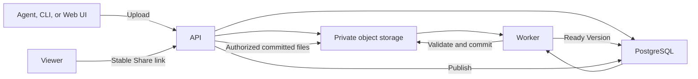

# ShareSlices

<div align="center">

<strong>Turn agent-made web artifacts into links worth sharing.</strong>

<p>
  Publish interactive HTML reports, presentations, and prototypes as stable,
  self-hosted links—directly from a terminal or an AI agent.
</p>

<p>
  <a href="https://github.com/walnut1024/ShareSlices/releases/latest"></a>
  <a href="https://github.com/walnut1024/ShareSlices/stargazers"></a>
  <a href="https://github.com/walnut1024/ShareSlices/discussions"></a>
</p>

<p>
  <a href="#quick-start">Quick start</a> ·
  <a href="#install-the-cli">Install CLI</a> ·
  <a href="#use-it-from-codex">Use with Codex</a> ·
  <a href="#run-the-local-stack">Run locally</a> ·
  <a href="PRODUCT.md">Product</a> ·
  <a href="https://github.com/walnut1024/ShareSlices/discussions">Discussions</a>
</p>

</div>


ShareSlices is the open-source share layer for static web artifacts created by
AI agents. An agent can build a polished report or presentation in a local
folder; ShareSlices validates that bundle, preserves immutable versions, and
returns one browser link people can open and share.

> [!IMPORTANT]
> ShareSlices is under active development. It currently supports desktop
> browsers and public, time-bounded sharing of static web artifacts. It is
> self-hosted: install the CLI against a ShareSlices server you operate or are
> invited to use.

## Quick start

Install the CLI, point it to your ShareSlices server, sign in, and publish a
local artifact:

```sh
curl -fsSL https://github.com/walnut1024/ShareSlices/releases/latest/download/install.sh | sh

export SHARESLICES_API_URL="https://shareslices.example.com"
shareslices auth login
shareslices publish ./report --name "Quarterly report"
```

The final command packages `./report`, waits until its Version is ready,
publishes it, and prints its Share link. A directory should contain a root
`index.html` (or one unambiguous root HTML file) plus any relative assets it
uses.

Want to inspect a Version before it becomes public? Use
[`shareslices artifact upload`](cli/README.md#artifact-upload) first, then
publish the ready Version explicitly.

## Why ShareSlices?

AI agents can produce rich, interactive HTML, but the result often remains a
local folder or a ZIP attachment. ShareSlices handles the handoff from agent
output to an audience without treating that output as trusted application code.

| What you need | What ShareSlices provides |
| --- | --- |
| Give someone a browser link | A stable Share link for an Artifact |
| Update content without changing the link | Immutable Versions and controlled republishing |
| Keep unfinished work private | Upload and Publish are separate actions |
| Share only for a limited period | Permanent, relative-duration, or exact-time expiration |
| Use it from an agent | An official Skill that delegates to the same CLI humans use |
| Keep content under your control | A self-hosted Web app, API, Worker, PostgreSQL, and S3-compatible storage |

## Install the CLI

The CLI is the fastest path for people, scripts, and agents. Each installer
downloads and verifies the matching GitHub Release binary; Rust and Node.js are
not required after installation.

### macOS Apple Silicon and Linux x86-64

```sh
curl -fsSL https://github.com/walnut1024/ShareSlices/releases/latest/download/install.sh | sh
```

The installer uses `~/.local/bin` by default. Re-run it to update, or choose a
different directory with `SHARESLICES_INSTALL_DIR` or `--install-dir`.

### Homebrew

```sh
brew install walnut1024/tap/shareslices
```

### Windows x86-64

```powershell
powershell -ExecutionPolicy Bypass -c "irm https://github.com/walnut1024/ShareSlices/releases/latest/download/install.ps1 | iex"
```

The installer adds `%LOCALAPPDATA%\\ShareSlices\\bin` to the user `PATH` when
needed. See the [CLI installation guide](cli/README.md#install) for exact
version installs, checksums, and platform details.

## Use it from Codex

The official `shareslices` Skill lets Codex recognize publish, upload,
inspection, export, and management requests while keeping the CLI as the only
client of the ShareSlices API.

1. [Install the CLI](#install-the-cli) and configure its API URL.
2. Copy the versioned Skill directory into Codex's user skill directory:

   ```sh
   git clone --depth 1 https://github.com/walnut1024/ShareSlices.git /tmp/shareslices
   mkdir -p ~/.agents/skills
   cp -R /tmp/shareslices/skill/shareslices ~/.agents/skills/shareslices
   ```

3. Restart Codex if the Skill is not listed, then invoke it explicitly:

   ```text
   $shareslices publish the static report in ./report and give me a link
   ```

The Skill checks the installed CLI's supported Agent protocol before it acts.
It keeps **Upload** private and only publishes when the request asks to share a
link. See [the Skill source](skill/shareslices/SKILL.md) for its complete
contract.

## What can be published?

ShareSlices accepts a ZIP bundle with a root HTML entry point. The Web UI also
accepts one self-contained `.html` or `.htm` file and packages it for you.

Good fits include:

- interactive reports and data stories
- keynote-style HTML presentations
- product demos and prototypes
- generated documentation and explainers
- other static, browser-rendered agent output

Artifacts can contain HTML, CSS, JavaScript, images, fonts, and data files
referenced with relative URLs. ShareSlices does not rewrite uploaded content.
Server-side code, audio, video, WebAssembly, nested archives, arbitrary binary
attachments, and root-absolute asset paths are outside the current format
boundary. [PRODUCT.md](PRODUCT.md) is authoritative for the full behavior and
limits.

## How it works

```text
Ask an agent to create an artifact
                  ↓
     Upload and validate the bundle
                  ↓
       Create an immutable Version
                  ↓
        Preview, then Publish it
                  ↓
        Share one stable browser link
```

Upload creates a private Version history. Publish selects a ready Version,
makes it externally accessible for a chosen duration, and returns the Share
link. The Viewer serves only validated, committed files from private storage.



## Run the local stack

Use this route to develop ShareSlices or operate a local instance. It starts
the Web app, API, Worker, PostgreSQL, MinIO, and Mailpit.

### Prerequisites

- [mise](https://mise.jdx.dev/)
- [Docker](https://docs.docker.com/get-docker/) with Docker Compose
- [pnpm](https://pnpm.io/) through the version declared by this repository

### Start

```sh
git clone https://github.com/walnut1024/ShareSlices.git
cd ShareSlices

cp .env.example .env
mise install
mise run install
mise run dev
```

Open [http://app.localhost:5173](http://app.localhost:5173). Mailpit is at
[http://127.0.0.1:8025](http://127.0.0.1:8025). Values marked `required`
in `.env.example` are development placeholders and must be replaced before a
real deployment.

```sh
mise run dev-status
mise run dev-logs
mise run dev-down
```

## Project map

| Path | Purpose |
| --- | --- |
| [`web/`](web/) | Management UI and browser surfaces |
| [`api/`](api/) | HTTP API, authentication, publication policy, and persistence |
| [`worker/`](worker/) | Artifact validation, processing, reconciliation, and thumbnails |
| [`cli/`](cli/) | Native CLI and versioned Agent protocol |
| [`skill/`](skill/) | Official ShareSlices agent Skill |
| [`db/`](db/) | PostgreSQL migrations |
| [`api/openapi/`](api/openapi/) | Checked HTTP wire contract |
| [`openspec/specs/`](openspec/specs/) | Implemented product requirements |
| [`docs/`](docs/) | Architecture, research, and contributor guidance |

## Development

Use repository tasks rather than invoking individual tools directly:

```bash
mise run dev         # build, start, and verify the complete local stack
mise run dev-status  # show containers and verify all local endpoints
mise run dev-logs    # follow stack logs
mise run dev-down    # stop the stack
mise run check       # authoritative local quality gate
```

Focused tasks such as `mise run web-test`, `mise run api-test`, and
`mise run rust-check` are available while iterating. API tests use their own
Compose project and ports, so they can run without stopping the development
stack. Administrative mutations remain explicit `ops-*` tasks. Start with
[AGENTS.md](AGENTS.md), then read the scoped guidance for the surface you plan
to change.

## Product and architecture

- [Product behavior and boundaries](PRODUCT.md)
- [Shared vocabulary](CONTEXT.md)
- [HTTP contract](api/openapi/openapi.yaml)
- [Implemented requirements](openspec/specs/)
- [Module architecture](docs/design/modules.md)
- [CLI reference](cli/README.md)

## Community and contributing

Questions, ideas, and examples belong in
[GitHub Discussions](https://github.com/walnut1024/ShareSlices/discussions).
For reproducible bugs and focused feature requests, use
[GitHub Issues](https://github.com/walnut1024/ShareSlices/issues).

Pull requests are welcome. Keep changes focused, preserve runtime boundaries,
and run `mise run check` before opening a pull request. Observable product or
public-contract changes follow the OpenSpec workflow in [AGENTS.md](AGENTS.md).

---

<div align="center">

Built for the moment when an agent says “done” and someone else needs to see
it.

</div>
